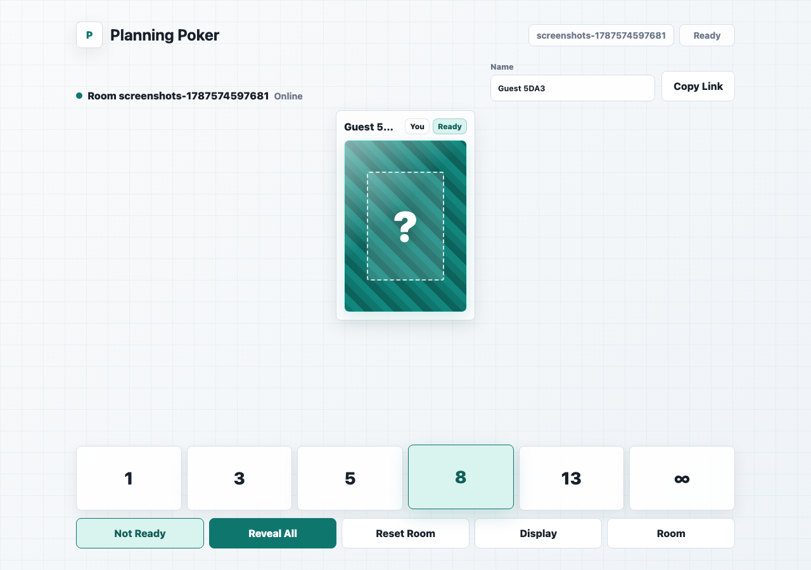
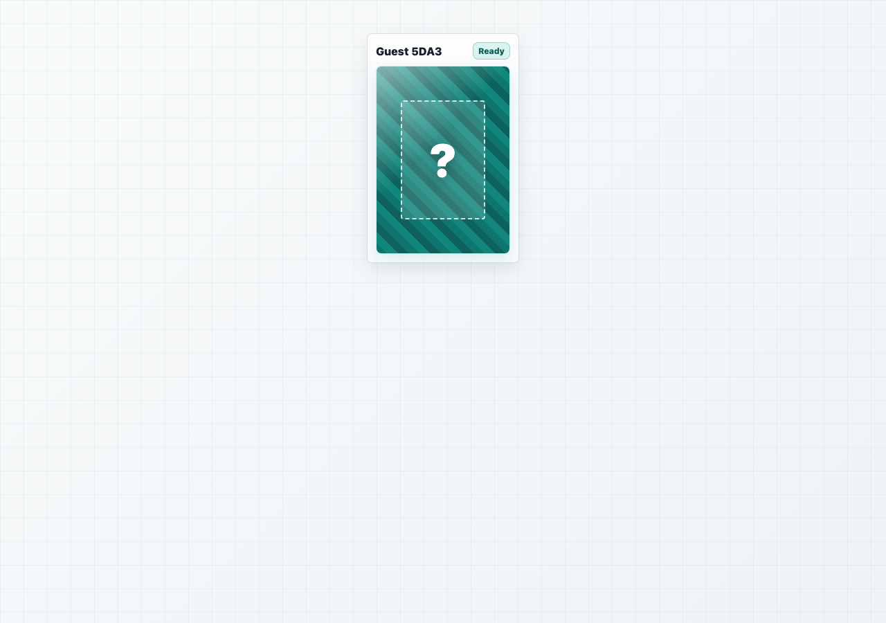
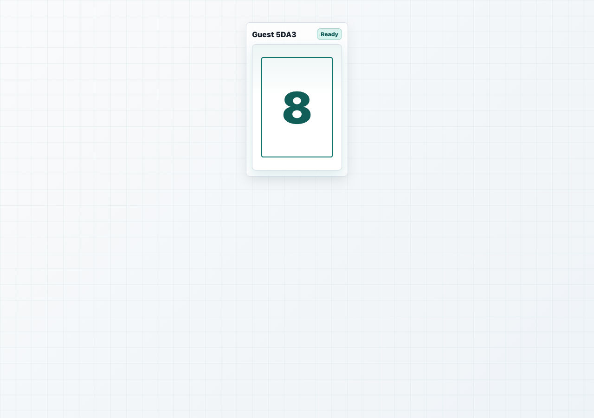

# Planning Cards

Planning poker cards for remote calls.

## Screenshots

Single-player:

| Controller | Public hidden | Public revealed |
| --- | --- | --- |
|  |  |  |

Shared room:

| Controller | Public hidden | Public revealed |
| --- | --- | --- |
|  |  |  |

## Run

Hosted:

- Controller: https://domjancik.github.io/planning-cards/
- Public display: https://domjancik.github.io/planning-cards/?view=public
- Shared room: https://domjancik.github.io/planning-cards/?room=demo
- Shared public display: https://domjancik.github.io/planning-cards/?room=demo&view=public

Simplest:

Open `index.html` in your browser. No Python or build step is required for the standalone controller.

Recommended for two synced tabs and clean local URLs:

```sh
python3 -m http.server 4173 --bind 127.0.0.1
```

Open:

- Controller: http://127.0.0.1:4173/
- Public display: http://127.0.0.1:4173/?view=public
- Shared room: http://127.0.0.1:4173/?room=demo

The controller also has a `Display` button that opens the public tab.

## Shared Rooms

Hosted shared rooms use the SpacetimeDB Maincloud database `planning-cards`.

Open a room URL such as `/?room=abc123`. Hidden card values stay in a private server table; clients only receive `hasSelection` until someone clicks `Reveal All`.

When changing the shared backend:

```sh
npm install
npm install --prefix spacetimedb
spacetime publish planning-cards --server maincloud -p spacetimedb --yes
npm run generate:spacetime
npm run build
```

## Test

```sh
npm install
npm test
```

Regenerate README screenshots:

```sh
npm run screenshots
```
