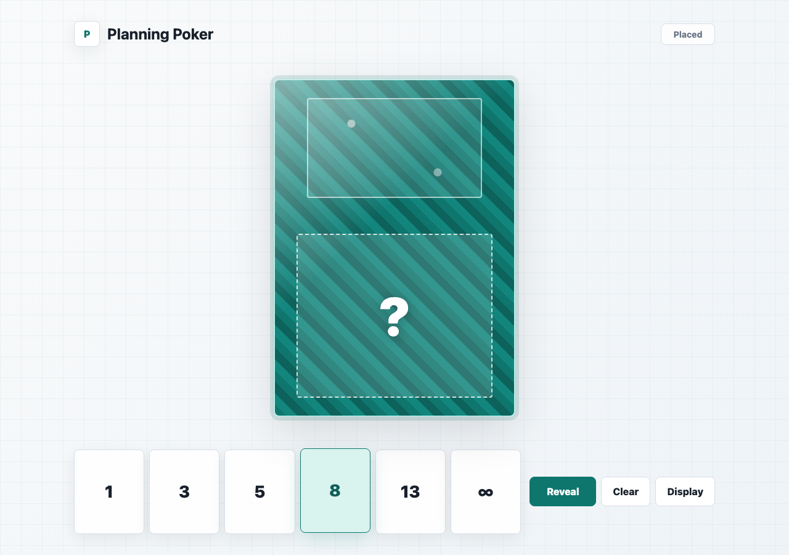
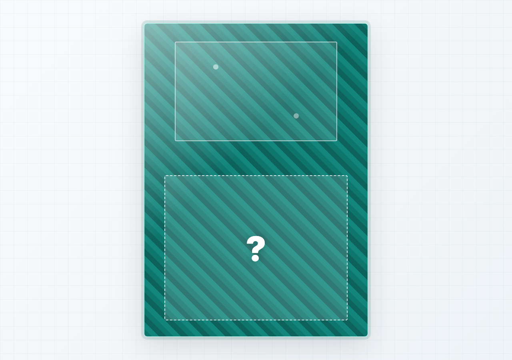
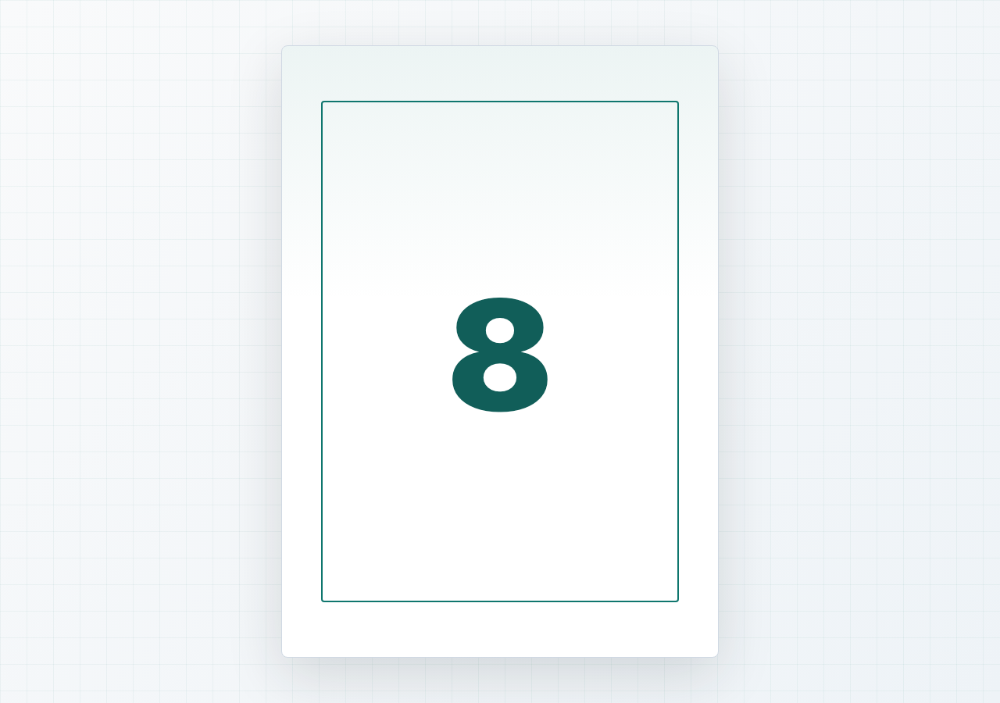

# Planning Cards

Planning poker cards for remote calls.

## Screenshots

| Controller | Public hidden | Public revealed |
| --- | --- | --- |
|  |  |  |

## Run

Simplest:

Open `index.html` in your browser.

Recommended for two synced tabs:

```sh
python3 -m http.server 4173 --bind 127.0.0.1
```

Open:

- Controller: http://127.0.0.1:4173/
- Public display: http://127.0.0.1:4173/?view=public

The controller also has a `Display` button that opens the public tab.

## Test

```sh
npm install
npm test
```

Regenerate README screenshots:

```sh
npm run screenshots
```
